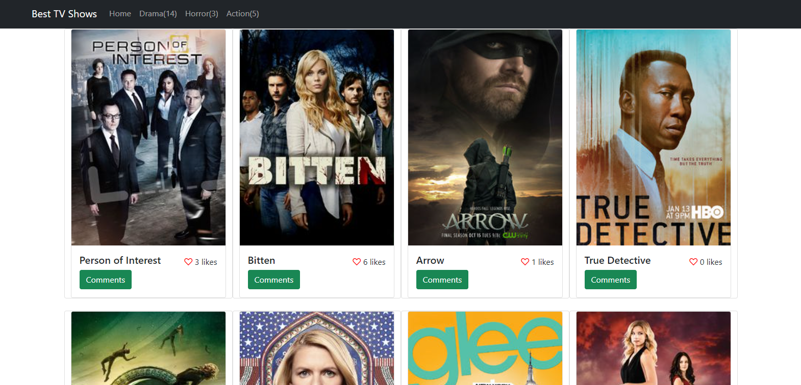
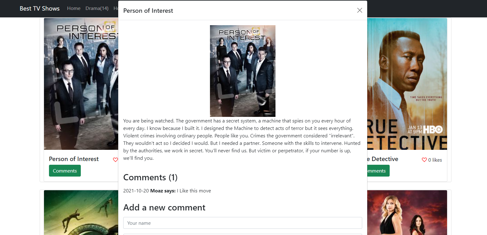
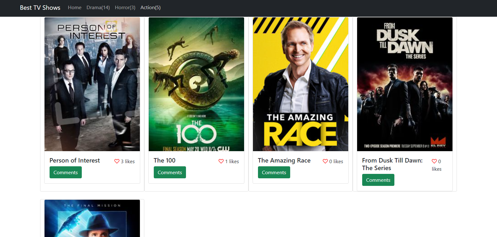

# JavaScript capstone

This project was created with the purpose of showing all the movies that are stored in an API, you can see all the movies and even include more, the movies are sorted by categories and you can also comment if you like a movie or if you don't.







## Built With

- HTML, JS & CSS

## Live Demo

[Live Demo Link](https://iammouaz.github.io/JavaScript-capstone/)

## Instalation

To get a local copy up and running follow these simple example steps.
- Open terminal
- Clone this project by command git clone https://github.com/iammouaz/JavaScript-capstone.git
- cd to /dist folder
- ```npm update```
- ```npm start```

### Prerequisites

- IDE to edit and run the code (I've used Visual Studio Code 🔥).

### Usage

- For anyone who wants to practice HTML5 and CSS.
- Implementation of webpack set up.
- Implementation of API's.

## Authors

👤 **Juan Marcos Mérida**

- GitHub: [@githubhandle](https://github.com/marcosmerida)
- LinkedIn: [LinkedIn](https://linkedin.com/in/marcos-merida-219437206/)

👤 **Mohammad Moaz El Mulki**

- GitHub: [@githubhandle](https://github.com/iammouaz)
- LinkedIn: [LinkedIn](https://www.linkedin.com/in/mohammad-mouaz-molki-1368981bb/)

## Show your support

Give a ⭐️ if you like this project!

